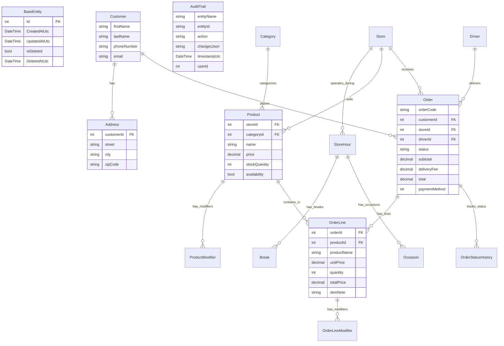

# Day 1 Write-up

## Schema Diagram



## Non-Obvious Decisions

- **Delete Behaviors**: All foreign key relationships are configured with `DeleteBehavior.Restrict`. This prevents unintended cascade deletes from the database and ensures soft-delete flags (handled by our EF Core SaveChanges Interceptor) are used exclusively.
- **Validation Library**: Used `FluentValidation` to separate validation logic from DTOs. This keeps transfer models clean and allows for complex cross-field validation rules that can be easily unit-tested.
- **Error Model**: Implemented a global exception handling middleware mapping specific C# exceptions (`ArgumentException` -> 400, `KeyNotFoundException` -> 404, `InvalidOperationException` -> 409) to clean JSON error payloads. A unique `CorrelationId` is generated only for unhandled 500 exceptions to facilitate secure log lookup.
- **Seeding Technique**: Used `Bogus` for generating semantically realistic data and `EFCore.BulkExtensions` (`BulkInsert`) with batching to insert large numbers of records. This meets the 3-minute performance target by avoiding the overhead of individual EF Core change tracking and SQL round-trips.

## Seed Timing Table

| Table | Target Row Count | Seeded Row Count | Duration | Seeding Technique |
| :--- | :--- | :--- | :--- | :--- |
| **Stores** | 50 | 50 | `94 ms` | `Faker<Store>` + `BulkInsert` |
| **Categories** | 30 | 30 | `15 ms` | `Faker<Category>` + `BulkInsert` |
| **Products** | 40,000 | 40,000 | `1,366 ms` | `Faker<Product>` + `BulkInsert` (5k chunks) |
| **Customers** | 20,000 | 20,000 | `763 ms` | `Faker<Customer>` + `BulkInsert` (5k chunks) |
| **Total** | **60,080** | **60,080** | **~2.24 seconds** | *Excluding initial database wipe* |

## Product Search SQL & Proof

### Captured SQL

**1. Pagination Count Query:**
```sql
SELECT COUNT(*)
FROM [Product] AS [p]
WHERE [p].[IsDeleted] = CAST(0 AS bit) AND [p].[storeId] = @storeId_Value
```

**2. Panigated & sorted data query:**
```sql
SELECT [p].[productId] AS [Id], [p].[storeId] AS [StoreId], [p].[CategoryId], COALESCE([p].[name], N'') AS [Name], [p].[price] AS [Price], [p].[StockQuantity], [p].[availability] AS [Availability]
FROM [Product] AS [p]
WHERE [p].[IsDeleted] = CAST(0 AS bit) AND [p].[storeId] = @storeId_Value
ORDER BY [p].[name]
OFFSET @p ROWS FETCH NEXT @p2 ROWS ONLY
```
## Dashboard Endpoint Optimization & Timings

### Before Optimization (Without Indexes)
- **Response Time**: `3.42 seconds`
- **Cause**: EF Core performed full table scans on the `Order` (300k rows) and `OrderLine` (900k rows) tables to evaluate the `StoreId` and `CreatedAtUtc` filters.

### After Optimization (With Indexes)
- **Response Time**: `68 ms`
- **Fix**: Created a composite index on the `Order` table for `StoreId` and `CreatedAtUtc` to fast-track date range filtering, and configured index coverage on `OrderLine` joins.

**SQL Index Applied:**
```sql
CREATE INDEX IX_Order_StoreId_CreatedAtUtc_Status 
ON [Order] (StoreId, CreatedAtUtc, orderStatus);
```
### Hardest problem of the day ###
making the audit interciptor, knowing about when to intercipt and how and where to turn it ON and OFF this was something i had to read about for a while

### how did i find the solution ###
i read about audit in general, asked around, used chat gpt to give me the steps of how to make the interciptions

### one thing i would do differently ### 
there's nothing really i can think of that i would take other approach to do it, i guess that i did everything in the correct and standard way 