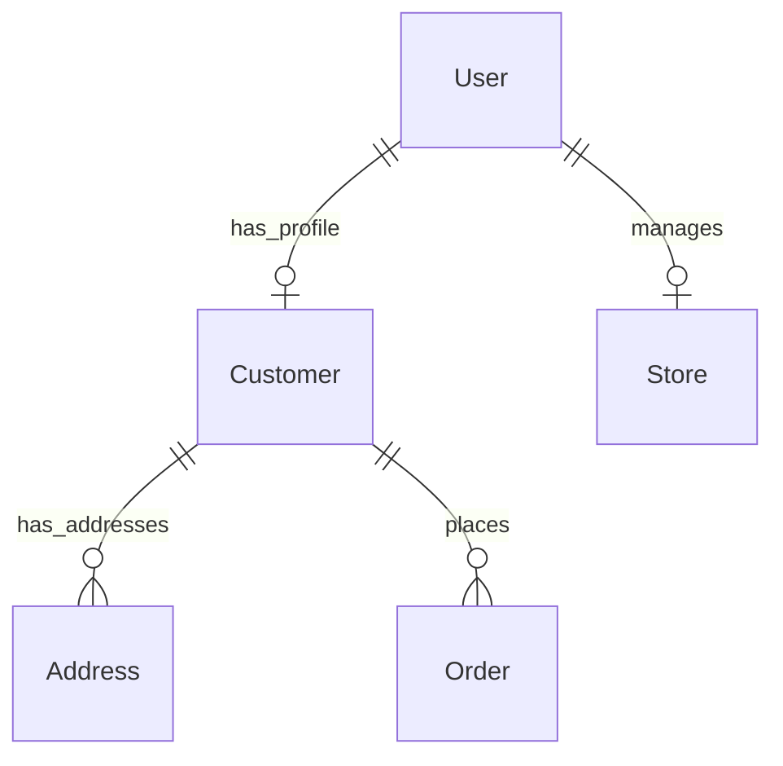

# Day 02: Identity, Authentication & Security Architecture

## 1. Architectural Decision: Separated Identity vs. Single-Table (Fat Model)
We evaluated two primary approaches for handling user identities and actor types (Customers, Partners, and Admins):
* **Single-Table Approach:** Storing credentials, roles, and all domain fields (delivery addresses, order history, store links) in a single large table with nullable columns.
* **Separated Identity & Domain Approach (Chosen):** Keeping a thin, dedicated `User` table strictly for authentication and authorization (IDs, contact details, password hashes, roles), linked via strict database relations to domain profiles (such as a 1-to-1 relationship with `Customer` or store management associations for `Partners`).

### Defense:
* **No Null Pollution:** Administrative and partner accounts do not require delivery addresses or customer order histories. Separating identity prevents irrelevant columns from littering non-customer rows as `NULL`.
* **Clean Separation of Concerns:** Security credentials and authentication mechanics are isolated from business logic and domain entities.
* **Extensibility:** Adding new actor roles (e.g., Drivers or Support Agents) requires introducing new lightweight domain tables rather than altering core authentication structures.

### Relationships Diagram:

---

## 2. Primary Key Type Strategy (`Guid` vs. `int`)
* **Decision:** The `User` entity uses a `Guid` as its primary key.
* **Defense:** Integer IDs (`int`) are sequential and predictable, making them vulnerable to ID enumeration attacks where malicious actors can guess or scrape user records by incrementing IDs in endpoints. Using `Guid` ensures unpredictable, collision-resistant identifiers across distributed environments and secures token claims.

---

## 3. Password Hashing Mechanism
* **Decision:** Implementation of ASP.NET Core's built-in `IPasswordHasher<User>` (utilizing PBKDF2 with HMAC-SHA256, salted hashes, and high iteration counts).
* **Defense:** Rolling custom cryptographic hashing implementations introduces vulnerabilities. ASP.NET Core's built-in provider is battle-tested. 
  * **Salt**: A salt is a unique, random string added to the password before hashing. It prevents attackers from using precomputed hashes (rainbow tables) to crack passwords.
  * **Slow Hashing**: Cryptographic hashing algorithms are deliberately designed to be slow and CPU-intensive to make brute-forcing password hashes infeasible.

---

## 4. OTP Design & SMS Security
* **OTP Code Generation**: Generated using `RandomNumberGenerator.GetInt32` (a cryptographically secure pseudorandom number generator, CSPRNG) to ensure codes are not predictable.
* **Storage & Expiry**: Stored in the memory cache with a 3-minute expiry.
* **Attempt Limiting**: Per-OTP code attempts are checked inside a lock block and limited to 3 guesses. Once exceeded, subsequent requests return `429 Too Many Attempts`.
* **Request Throttling**: A 60-second rate limit window is enforced per phone number on OTP requests to prevent budget draining.
* **SMS Gateway Abstraction**: Handled behind `ISmsSender` (implemented locally as `SmsService`) which only logs the OTP code. The code is never returned in HTTP responses.

---

## 5. Security & JWT Details
* **Secrets**: Managed via .NET User Secrets in development and environment variables in production.
* **Claims**: Contains `sub` (user ID), role, and `storeId` (for Partners).
* **ICurrentUser Concurrency**: Wired as a `Scoped` service lifetime. Since a scoped service is instantiated once per HTTP request, it avoids cross-request data leaks.
* **Fast Seeding**: Seeding remains fast because Customers have no passwords to hash (only staff accounts undergo password hashing).

---

## 6. Access Control and Ownership
* **Coarse Access Control**: Enforced using ASP.NET Core `[Authorize(Roles = "...")]` attributes.
* **Fine-Grained Ownership**: Validated on the database level in services by checking that the query target belongs to the caller's ID or store ID. The `storeId` in claims is re-verified against the database to prevent stale token hijacking.

---

## 7. Attack Log Summary
All 12 security attack vectors in `security_attacks.http` have been evaluated and are verified as **BLOCKED**. Details of the penetration tests are documented in `docs/day-02-attack-log.md`.