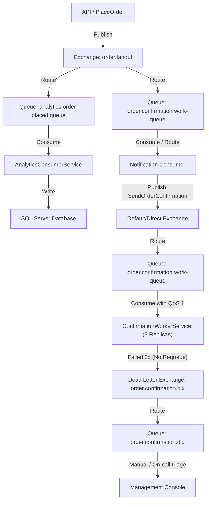

# Day 5 — Messaging with RabbitMQ: Events, Fan-out, and Surviving Redelivery

This document captures the architectural decisions, topologies, contract designs, failure modes, and operational parameters for our RabbitMQ integration.

---

## 1. Topology Diagram

The following Mermaid diagram illustrates our RabbitMQ messaging architecture, showing how events from the system flow through exchanges, queues, DLQs, and their respective consumers:



---

## 2. Message Contract

All published events conform to strict integration contracts. The core event for our order lifecycle is defined as follows:

### OrderPlacedEvent Schema
```json
{
  "MessageId": "00000000-0000-0000-0000-000000000000",
  "EventName": "OrderPlaced",
  "Version": 1,
  "TimestampUtc": "2026-08-16T11:09:58Z",
  "OrderId": 12345,
  "StoreId": 67890,
  "CustomerId": 11223,
  "TotalAmount": 150.75
}
```

### Why MessageId and Version are Mandatory on Every Message
1. **`MessageId` (UUID)**: 
   * **Tracking & Traceability**: Serves as a unique identifier for distributed tracing across isolated microservices or services.
   * **Idempotency Key**: Serves as the primary key in the deduplication store (`ProcessedMessages`). Without a unique message identifier, consumers cannot distinguish between a redelivered message (due to a transient network drop or consumer crash) and a distinct business event happening to have the same body properties.
2. **`Version` (Integer)**: 
   * **Schema Evolution**: As business requirements evolve, the schema of `OrderPlacedEvent` will change (e.g., adding discount codes, shipping details).
   * **Backward Compatibility**: A version field allows consumers to determine how to deserialize and process the payload. Older consumers can parse version 1 fields, while newer consumers can handle version 2+ structures, preventing system-wide lockstep deployments.

---

## 3. Redelivery & Idempotency

### At-Least-Once Delivery Behavior
RabbitMQ guarantees **at-least-once delivery**. When a consumer pulls a message, the broker marks the message as `Unacknowledged` and holds it in memory. Only after the consumer finishes processing and issues a `BasicAck` will the broker delete the message. If the consumer connection drops, the application crashes, or a DB transaction rolls back before an ACK is received, RabbitMQ instantly puts the message back into the queue for redelivery.

### The Double-Count Anomaly (Part 2 Experiment)
* **The Failure**: We simulated a crash in `AnalyticsConsumerService` by throwing an exception immediately *after* updating the store's sales tally in SQL Server but *before* calling `BasicAck` on the channel.
* **The Result**: RabbitMQ detected the consumer disconnect, requeued the message, and redelivered it. The naive consumer picked it up again, processed the database increment, and successfully acked. The store's analytics tally ended up inflated by the double-count (incremented twice for a single order).

### The Fix: ProcessedMessage Table & Unique Constraint
To enforce idempotency, we introduced a deduplication step inside the database transaction:
1. A database table `ProcessedMessages` was created with a `UNIQUE` index/primary key on the `MessageId` column.
2. Before processing any business logic (updating analytics), the consumer inserts a row into `ProcessedMessages` containing the event's `MessageId`.
3. Because this insertion happens in the **same database transaction** as the analytics update:
   - If the message is processed for the first time, both the deduplication row and the analytics updates commit successfully.
   - If the message is redelivered and processed a second time, the database throws a unique constraint violation on `MessageId`. The transaction rolls back, preventing the analytics update from occurring again.
   - The consumer catches this unique constraint violation, logs a warning indicating a duplicate message was skipped, and gracefully issues a `BasicAck` to clear the duplicate message from RabbitMQ.

---

## 4. Fanout vs. Work Queue

We leverage two distinct queue topologies depending on the business requirements:

| Topology | Use Case | Routing Mechanism | Consumer Behavior |
| :--- | :--- | :--- | :--- |
| **Fanout** | `OrderPlaced` broadcasting | Broadcasts a copy of the event to all bound queues. | Multiple independent services (Analytics, Notifications) react to their own copy of the event without interfering with each other. |
| **Work Queue** | `SendOrderConfirmation` | Competing consumer queue bound to the direct exchange. | One queue, multiple replica workers. Each message is processed by exactly one available worker. |

### Competing Consumers & Prefetch (QoS = 1)
When running multiple replicas of the worker service (e.g., three instances on ports `5101`, `5102`, and `5103`), RabbitMQ distributes messages.
* **Unlimited Prefetch (Default)**: RabbitMQ pushes messages in strict round-robin rotation to all active consumers without considering their current load or execution speed. If worker A gets assigned a slow message (e.g., a 3-second delay) and workers B and C get fast messages, A will stack up pending messages, leaving B and C idle while the overall batch processing time drags.
* **Prefetch QoS = 1**: By configuring `BasicQos(prefetchCount: 1)`, we restrict each worker to holding at most **one** unacknowledged message. RabbitMQ will only send a new message to a worker after it successfully ACKs its current message. This acts as a pull-based model where idle workers pull work dynamically.

#### Performance Measurements (30 Messages, 3 Competing Workers)
* **Without Prefetch Limit**: ~30 seconds (due to slow messages queuing up behind a single worker node due to naive round-robin).
* **With Prefetch QoS = 1**: ~11.5 seconds (the workload is distributed dynamically to whichever worker is free, keeping all replicas fully utilized).

> [!WARNING]
> **Ordering Guarantee Loss**: With competing consumers, **message processing order is no longer guaranteed**. If message sequence is critical (e.g., `OrderPlaced` must be handled before `OrderCancelled`), competing consumers on a single queue will cause race conditions. Sequential processing requires single-threaded consumers, message routing by key (consistent hashing), or saga orchestration.

---

## 5. Poison Messages & DLQ

A poison message is a message that cannot be processed successfully due to malformed data, schema mismatch, or logical bugs. Left unchecked, a naive retry loop (`nack` with `requeue: true`) causes the consumer to fail, requeue, and re-fetch the message indefinitely. This halts the queue progression, burns CPU, and fills the logs.

### Dead-Letter Queue (DLQ) Strategy
We implement a **3-attempt retry limit** before dead-lettering:
1. **Tracking Attempts**: Since RabbitMQ's raw client doesn't manage message attempt counts automatically, we carry the attempt count inside the message headers (`x-attempt-count`).
2. **On Failure (Attempts < 3)**: The consumer increments the `x-attempt-count` header, republishes the message back to the work queue, and ACKs the original message.
3. **On Failure (Attempts >= 3)**: The consumer rejects the message by calling `BasicNack(requeue: false)`.
4. **Dead-Letter Routing**: Because the queue is configured with the argument `"x-dead-letter-exchange": "order.confirmation.dlx"`, RabbitMQ automatically intercepts any rejected (non-requeued) message and routes it to `order.confirmation.dlq`.

#### Operational Triage (3:00 AM Scenario)
When a poison message hits the DLQ:
* Automated alerts (e.g., Prometheus/Grafana or broker monitors) notify the on-call engineer that the DLQ depth is greater than zero.
* The engineer inspects the message payload, exception headers, and attempt metadata via the RabbitMQ Management dashboard.
* Since the poison message is isolated in the DLQ, **the main queue continues processing healthy messages uninterrupted**.
* Once the bug is fixed, the engineer can republish the message from the DLQ back into the main queue for reprocessing.

---

## 6. Command vs. Event Classification & Dual-Write Gap

### The Classification Rule
* **Hangfire (Command)**: `"Run this task"`. There is a single owner/actor, the publisher knows exactly what must run and manages the lifecycle (retry policy, delays, cron schedules).
* **RabbitMQ (Event)**: `"This happened"`. The publisher broadcasts a factual occurrence to a broker and has no awareness, care, or control of who consumes it or what reactions occur.

#### Scenario Analysis
1. **Scenario A (Order Placed side-effects)**: **RabbitMQ (Event)**. An order placement is a historical fact. Multiple decoupled consumers (Notification, Analytics, Loyalty) react to it. Allows new reactions to be added without code changes to checkout.
2. **Scenario B (Nightly Sales Reports at 02:00 UTC)**: **Hangfire (Command)**. A scheduled time-bound trigger. Requires single-instance execution coordination across replicas and robust state persistence.
3. **Scenario C (Sending an OTP Text immediately)**: **Hangfire (Command / Fire-and-Forget)**. A directed execution instruction with a single dedicated actor (the SMS gateway integration) that requires immediate, reliable execution and local retry capability.
4. **Scenario D (Notifying an external team's shipping system)**: **RabbitMQ (Event)**. An integration boundary event. Publishing `OrderDeliveredEvent` decouples the core domain from the external team's availability, network endpoint, and internal failures.

---

### The Dual-Write Gap
In our checkout flow, we write to two different storage engines sequentially without a distributed transaction:
```csharp
// The Dual-Write Gap
await dbContext.SaveChangesAsync(); // Write 1 (SQL Server)
_eventPublisher.Publish(orderPlacedEvent); // Write 2 (RabbitMQ)
```

This introduces two distinct, critical failure windows:

#### Crash Pattern 1: Commit Succeeds, Publish Fails
* **Scenario**: The database transaction commits successfully, saving the order. Immediately after, the application crashes (e.g., out-of-memory, node reboot, broker connection drop) before the publish line executes.
* **Impact**: The order exists in SQL Server, but no `OrderPlacedEvent` is published. The customer never receives a confirmation email, and the analytics tallies remain unchanged. No system alerts trigger, creating a silent business failure.

#### Crash Pattern 2: Publish Succeeds, Commit Fails
* **Scenario**: If we reversed the lines and published the event *before* saving to the database, the event goes to RabbitMQ successfully. However, the database transaction subsequently fails (e.g., deadlocks, constraint violations, connection timeout) and rolls back.
* **Impact**: The event is published to RabbitMQ representing an order that *does not exist*. Consumers (Notifications, Analytics, Loyalty) process the event, generating confirmation emails and incrementing financial metrics for a "ghost" order, leading to database-to-broker inconsistency.

> [!NOTE]
> **Resolution**: We acknowledge this gap but deliberately leave it unfixed for now. Proper mitigation requires implementing the **Outbox Pattern**, where events are saved to a dedicated `Outbox` table in the database within the *same* SQL transaction as the business entity, and a separate background publisher (such as a Hangfire job or worker) polls the Outbox table to reliably dispatch messages to RabbitMQ.

---

## 7. The Hardest Challenge Today

**The Non-Thread-Safety of RabbitMQ Channels**:
The most complex issue faced today was managing the lifetime and concurrency of RabbitMQ `IModel` (channels). RabbitMQ channels are explicitly **not thread-safe**. Sharing a channel across threads or using a singleton channel to publish and consume concurrently causes intermittent frame corruption and silent channel closure.

We resolved this by:
1. Registering the `IConnection` as a singleton lifecycle class.
2. Opening a dedicated channel (`IModel`) per `BackgroundService` consumer and publishing context, ensuring that no two threads invoke methods on the same channel instance simultaneously.
3. Using the database transaction as a logical boundary for processing and deduplication, separating network-bound broker logic from transactional persistence boundaries.
