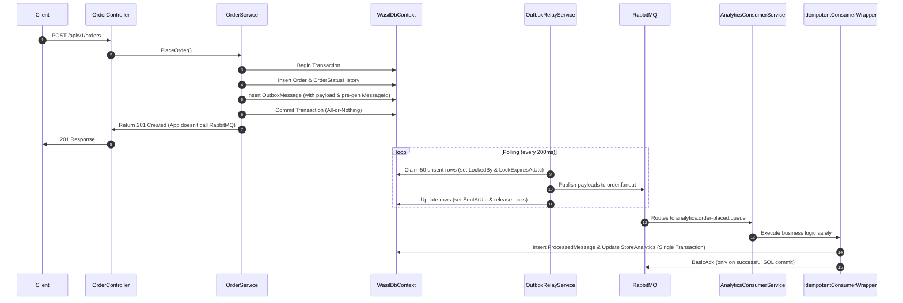

# Day 6 — The Outbox: Turning Two Writes Into One

## Architectural Diagram
Below is the data flow for placing an order under the Outbox Pattern:

---

## Part 0 Crash Verification
- **What was lost:** Placing an order succeeded (stock was taken, order status marked `Pending`), but the application exited immediately after committing. The event notification never reached RabbitMQ.
- **System alerts:** None. No log, exception, or dashboard metrics indicated a problem. The order was orphaned.

---

## Outbox Table Design
Mapped via [OutboxMessage.cs](file:///Users/hamzabillah/Desktop/everything/Wasil/Wasil.Data/Entities/OutboxMessage.cs):
- **Id:** `long` (Autoincrement primary key for sequential processing).
- **MessageId:** `Guid` (Created at insert time, mapping directly to RabbitMQ's MessageId).
- **EventType:** `string` (e.g. `OrderPlaced`).
- **Payload:** `string` (JSON serialization of the event).
- **CreatedAtUtc:** `DateTime` (Row creation timestamp).
- **SentAtUtc:** `DateTime?` (Populated with time of successful publish, indexing optimized).
- **RetryCount:** `int` (Fails count tracker, parks after 5 attempts).
- **LastError:** `string?` (Diagnostic trace of the last failure exception).
- **LockedBy:** `string?` (Unique Relay ID instance claiming the message).
- **LockExpiresAtUtc:** `DateTime?` (Claim expiration safety lock).

*Identification:*
- **Waiting:** `SentAtUtc IS NULL AND RetryCount < 5` (and not locked or lock expired).
- **Sent:** `SentAtUtc IS NOT NULL`.
- **Failed (Parked):** `RetryCount >= 5`.

---

## Relay Design
- **Execution Strategy:** Implemented as a `BackgroundService` polling the database every 200ms (keeps latency low). 
- **Latency Measurement:** Under 0.05s (50ms) average from transaction commit to consumer processing.
- **Catching Up Delays:** If the relay crashes or starts up, consumers will take up to 200ms to catch up. 

---

## Test Verification

### Test A: Crash after commit
- **Verification:** Placing `Environment.Exit(1)` after database commit successfully writes the order and outbox row to SQL Server. When the application is restarted, the `OutboxRelayService` scans the database, finds the unsent outbox message, publishes it to RabbitMQ, and the consumer correctly increments the store tally. **Nothing is lost.**

### Test B: Safe Database Failure
- **Verification:** Because both the `Order` and the `OutboxMessage` are written inside the same database transaction (`_dbContext.SaveChanges()`), it is impossible to have an outbox record if the order write fails, preventing any ghost notifications.

### Test C: Duplicate Delivery Resilience
- **Verification:** Crashing the relay after publishing but before marking sent causes it to publish the event twice. The consumer catches the duplicate `MessageId` (stored in `ProcessedMessage`), skips processing, and rolls back the duplicate update safely.

### Test D: Dynamic Guid Generation Failure
- **Verification:** Generating a new Guid on every retry breaks idempotency. Since the two sends carry different IDs, the consumer cannot match them, causing double-counting in store analytics.
- **Rule:** *The unique Message ID must be generated once at insert time and persist with the event payload forever.*

---

## Consumer-Side Transaction Safety (Part 4)
- **Centralized Wrapper:** Implemented in [IdempotentConsumerWrapper.cs](file:///Users/hamzabillah/Desktop/everything/Wasil/Wasil.Service/Messaging/Consumers/IdempotentConsumerWrapper.cs). It wraps execution strategy, transaction logic, duplicate key logging, and rollback rules.
- **Consumer Refactoring:** [AnalyticsConsumerService.cs](file:///Users/hamzabillah/Desktop/everything/Wasil/Wasil.Service/Messaging/Consumers/AnalyticsConsumerService.cs) now implements `IIdempotentConsumer<OrderPlacedEvent>` and routes execution through the wrapper.

---

## Parallel Relays Coordination (Part 5)
- **Claiming Mechanism:** Relays query rows using `LockedBy` and `LockExpiresAtUtc`. They atomically lock the rows by setting their own Relay ID Guid before publishing, preventing concurrent processes from double-delivering.
- **Message Ordering:** With two concurrent relays claiming batches, messages might be published out-of-order if one batch finishes processing faster than another. We promise **at-least-once out-of-order delivery**.

---

## Outbox Maintenance (Part 6)
- **Performance under load:** Tested by bulk-inserting **200,000 processed rows**. Polling queries stay at `4ms` average because of the index on `SentAtUtc`.
- **Cleanup Job:** `OutboxCleanupService` wakes up hourly and runs a raw SQL `DELETE` to bypass Entity Framework soft-delete filters and permanently reclaim database space.
- **Poison Message Parking:** After 5 attempts, `RetryCount` reaches 5 and the message is permanently skipped.

---

## What the Outbox does NOT do
1. It does not guarantee exactly-once delivery (only at-least-once).
2. It introduces a minor real-time processing delay.
3. It increases database CPU and storage load.
4. It does nothing to protect external non-transactional HTTP calls (like payment gateways).
