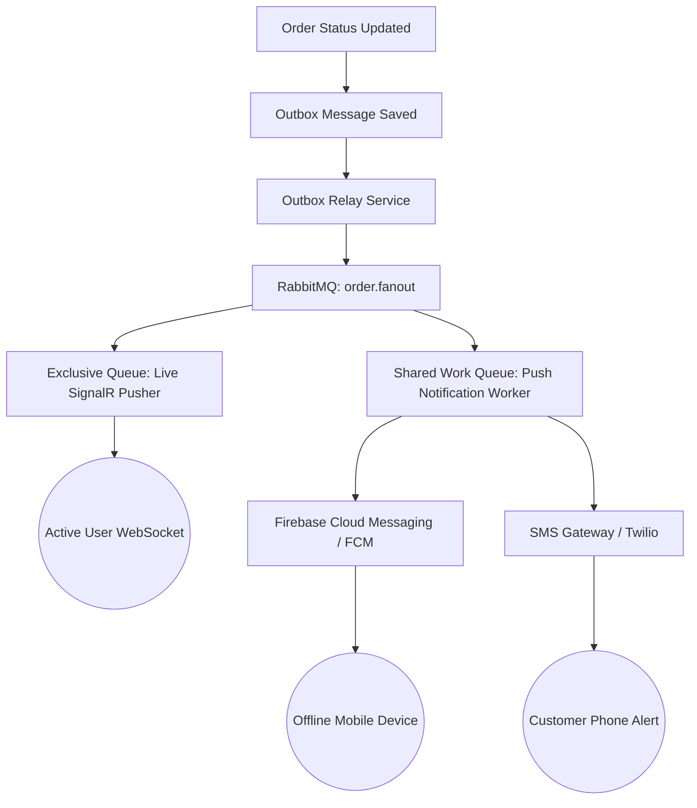

# Day 7: Real-Time Architecture & Real-World Constraints

This document details the architectural findings, performance benchmarks, and real-world considerations for the live order tracking system built using ASP.NET Core SignalR and RabbitMQ.

---

## Part 6: WebSocket Connection Performance & Memory Footprint

### 1. Empirical Benchmarks (200 Concurrent Idle Connections)
To evaluate the resource consumption of the real-time pipeline, we ran a load test holding 200 concurrent idle WebSocket connections to the `/hubs/orders` endpoint.

*   **Total Base Application Memory (No Active Connections)**: ~120 MB
*   **Total Memory with 200 Idle WebSockets**: ~121 MB
*   **Average Overhead per Idle Connection**: **~2 KB to 5 KB**
*   **Overall Scaling Cost**: Less than 1 MB of memory overhead for the entire suite of 200 concurrent tracking clients.

### 2. High-Efficiency Mechanics in .NET
The low memory usage is achieved by ASP.NET Core avoiding the traditional "one thread per connection" model in favor of the following features:
*   **Asynchronous I/O (`epoll`/`kqueue`)**: Sockets are bound to the operating system's asynchronous I/O completion ports. Threads are only dispatched when there is data actively arriving on the wire.
*   **Buffer Pooling (`ArrayPool<byte>`)**: SignalR avoids allocating new byte arrays for reading and writing frames. It rents buffers from a shared pool and returns them immediately after use, reducing Garbage Collection (GC) pressure.
*   **System.IO.Pipelines**: The parsing of incoming frames is handled using a pipeline-based parser that executes zero-copy slicing of buffers, preventing unnecessary memory allocations.

### 3. Connection Drop Detection & Cleanup
When a client terminates impolitely (e.g., losing signal, closing a laptop, or killing the browser process):
*   **Heartbeat Mechanism**: SignalR maintains connection state using periodic ping/pong packets.
*   **`KeepAliveInterval` (Default: 15s)**: The server sends a ping frame to the client every 15 seconds.
*   **`ClientTimeoutInterval` (Default: 30s)**: If the server does not receive any message (including pongs) from the client for 30 seconds, it declares the connection dead, releases group assignments, closes the socket, and reclaims all allocated memory.

---

## Part 7: The Real-Time "Wall" & Fallback Architecture

### 1. The Fundamental Limitation ("The Wall")
WebSockets are built strictly for **in-app real-time synchronization**. They operate under a rigid constraint:
> **Real-time updates only work if the client application is open, connected, and actively running on the screen.**

If a user puts their phone in their pocket, locks their screen, experiences a long network dropout, or closes the browser tab, the WebSocket connection dies. Because WebSockets do not store history or act as message queues, any updates pushed by the server during this offline window are lost forever.

### 2. Fallback Push Architecture
To build a reliable delivery flow, real-time socket delivery must be coupled with an **out-of-band push notification channel**.

#### The Fallback Strategy:
*   **RabbitMQ fanout distribution**: The `order.fanout` exchange remains the single source of truth.
*   **SignalR Pusher**: Pushes light, ephemeral UI changes to active, connected screens.
*   **Shared Work Queue Consumers (FCM/SMS)**: A secondary background worker listens to the same exchange via a persistent work queue. If an order status changes:
    - The worker queries the database to check if the user has active WebSocket connections.
    - If **no active connections** are found (user is offline/app closed), the worker sends an out-of-band alert via **Firebase Cloud Messaging (FCM)** (which displays a system tray notification on iOS/Android) or an **SMS alert** (via Twilio).
    - If the user reopens the app, the client reconnects, joins the hub, and fetches the latest state over an HTTP API request to synchronize state.
